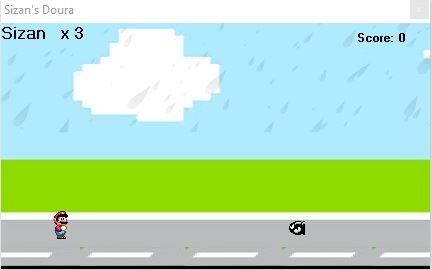

# 2D-Doura-Game
This is a simple 2D game based on image position and visual illusion. Coded in VB. 
Firstly, Extract the zip file and then open project file with visual basic 6.

Screen Shot:

Information:
- Programming Language: VB
- Compiler: VB6

Features:
- Very Easy Interface 
- Live System 
- Score Calculation 
- Fully open source & free.

